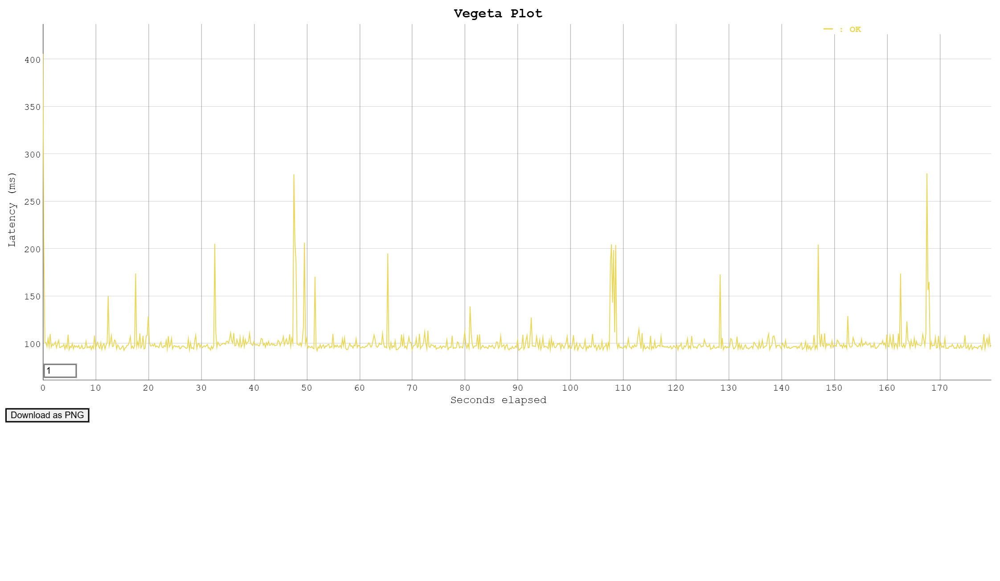
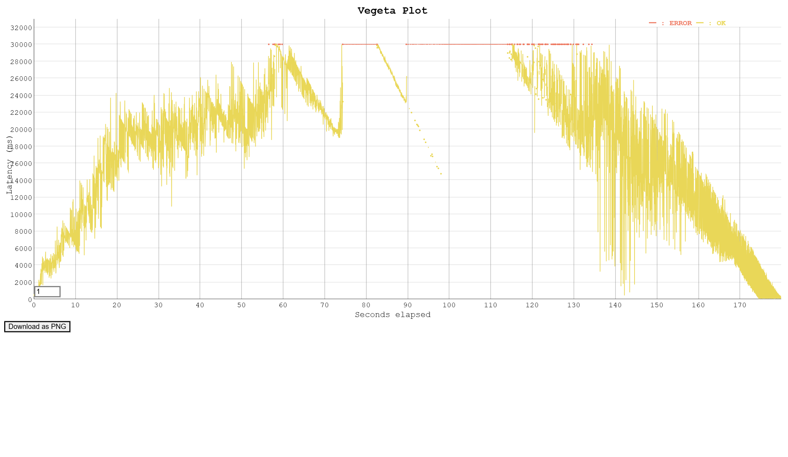
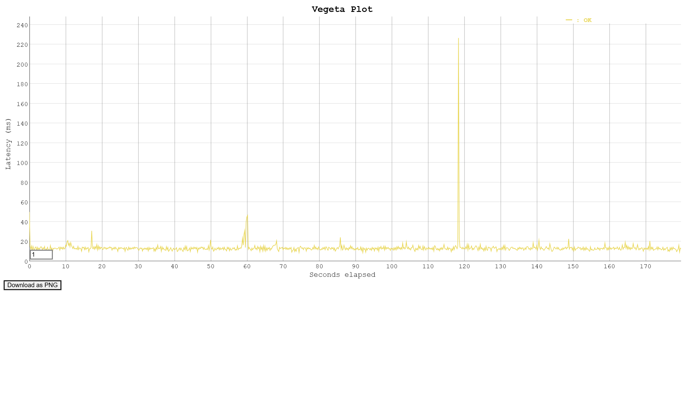
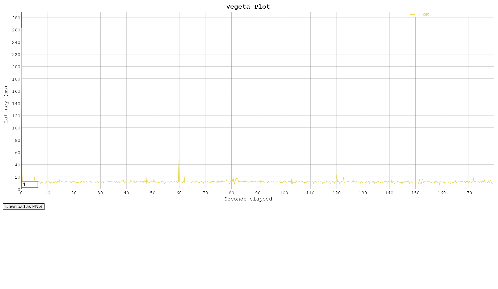

# AWS Infrastructure PoC with Terraform & CI/CD

[](https://www.terraform.io/)
[](https://golang.org/)
[](https://github.com/features/actions)

本プロジェクトは、トラフィック急増に耐えうるクラウドインフラの構築、およびそのパフォーマンス限界を実践的に検証したPoC（概念実証）です。Infrastructure as Code (IaC) による環境構築、CI/CDパイプラインによる自動デプロイ、および専用ツールを用いた負荷テストを実施し、高負荷時のボトルネック特定とキャッシュ技術の有効性を証明しました。

---

## 🏗️ システムアーキテクチャ


*図1: 本プロジェクトのシステムアーキテクチャ*

### AWSリソース構成
| レイヤー | サービス | 役割・設定 |
| :--- | :--- | :--- |
| **エッジ層** | Amazon CloudFront | 静的レスポンスのキャッシュ配信（レイテンシ短縮・オリジン負荷削減） |
| **ルーティング層** | Application Load Balancer (ALB) | トラフィックの受け口およびEC2群への負荷分散 |
| **コンピューティング層** | Amazon EC2 (t4g.micro) | Goアプリケーションの実行環境（ARM64 / Graviton2 プロセッサ） |
| **スケーリング制御** | EC2 Auto Scaling | CPU使用率等のメトリクスに基づくインスタンスの自律的な増減 |
| **ストレージ・状態管理** | Amazon S3 / DynamoDB | アプリバイナリの保存、およびTerraformのState/Lock管理 |

---

## 💡 本プロジェクトの技術的工夫点（ハイライト）

単なるリソースの作成に留まらず、本番運用・チーム開発を見据えた以下のモダンなプラクティスを導入しています。

### 1. GitHub ActionsによるCI/CDパイプラインの構築
バックエンド（Go）のコード更新をトリガーに、ARM64アーキテクチャ向けのビルドとS3へのデプロイを完全自動化しました。これにより、開発者のローカル環境に依存しない再現性の高いデプロイフローを確立し、ヒューマンエラーを排除しました。また、インフラ（EC2のUserDataによるPull）とアプリのライフサイクルを分離した疎結合なアーキテクチャを実現しています。

### 2. TerraformにおけるState Lock（排他制御）の導入
S3バックエンドでのState管理に加え、DynamoDBを用いたState Lockを導入しました。複数人での同時 `terraform apply` による状態ファイルの競合・破壊を防ぐ、チーム開発の必須要件を満たした構成としています。

### 3. 統一規格での自動負荷テストと視覚的エビデンスの生成
テストツール（Vegeta）の実行からHTMLグラフの生成までをシェルスクリプトで完全自動化しました。テスト時間（180秒）やリクエストレートを固定することで人間による「実行ブレ」を排除し、限界点やキャッシュ効果を視覚的なグラフとして客観的に証明する仕組みを構築しました。

---

## 📊 負荷テストによる仮説検証シナリオと結果

意図的に処理の重いエンドポイント（`/api/heavy`）と軽いエンドポイント（`/api/info`）を用意し、各180秒間のテストを実施しました。

### シナリオ1: 基準値の測定
* **条件:** ALB経由 (`/api/heavy`) / 5 rps
* **結果・考察:** 単一インスタンスの平常時の処理能力を定義。レイテンシ約100msで安定稼働することを確認しました。



### シナリオ2: キャパシティ限界とASG挙動
* **条件:** ALB経由 (`/api/heavy`) / 30 rps
* **結果・考察:** キューの滞留によりレイテンシが指数関数的に増大し、タイムアウト（30秒）が発生。「リアクティブなAuto Scalingだけでは突発的なスパイクに間に合わない」という分散システムの現実的な課題を可視化しました。



### シナリオ3 & 4: CDNキャッシュの有効性
* **条件:** CloudFront経由 vs ALB直接 (`/api/info`) / 5 rps
* **結果・考察:** CloudFrontを経由させることで、オリジンへの通信到達を防ぐだけでなく、ネットワークの揺らぎ（ジッタ）を極限まで抑え、平均レイテンシをより低く安定させることに成功しました。





---

## 🛠️ 再現手法（Usage）

本環境は完全にIaC化されており、以下のサイクルで「破壊と再生」を短時間で実行可能です。

```bash
# 1. バックエンド基盤の作成
./init.sh

# 2. インフラの自動構築
terraform apply -auto-approve

# 3. アプリの配置 (GitHub Actionsを利用)
# 4. 負荷テストの実行
bash ./load-test-script.sh

# 5. リソースの完全撤収
terraform destroy -auto-approve
```

---
## 🚀 今後の展望・システム成長に向けた課題

本システムが今後さらに大規模化・商用化していくことを見据え、以下の技術導入を次のフェーズの目標としています。

Terraformのディレクトリ分割・モジュール化: ネットワーク層、コンピューティング層、データベース層などをModuleとして分割（ディレクトリ方式の採用）し、ブラストラジアス（影響範囲）の限定とコードの再利用性を向上。

静的コード解析のCI組み込み: tflint や tfsec をGitHub Actionsに組み込み、構文エラーやクラウドのベストプラクティス違反、セキュリティ上の脆弱性を apply 前に自動検知する仕組みの構築。

OIDC認証への高度化: CI/CDにおいて、静的なIAMユーザーのアクセスキーをGitHubのシークレットに保存する方式から、OpenID Connect (OIDC) を用いた一時的（一時クレデンシャル）な認証方式へ移行し、セキュリティレベルをさらに強化。
