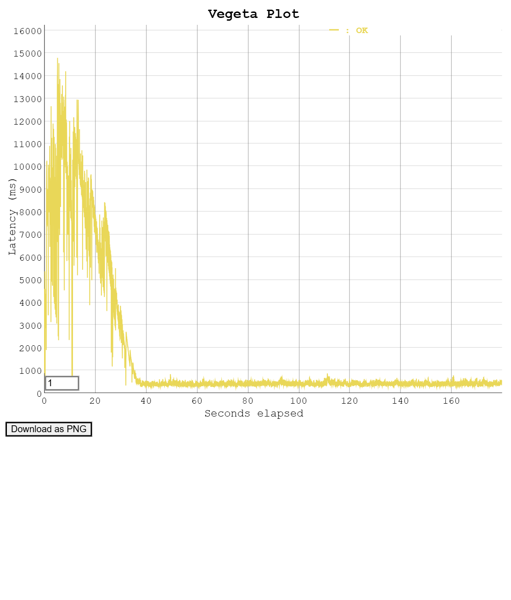
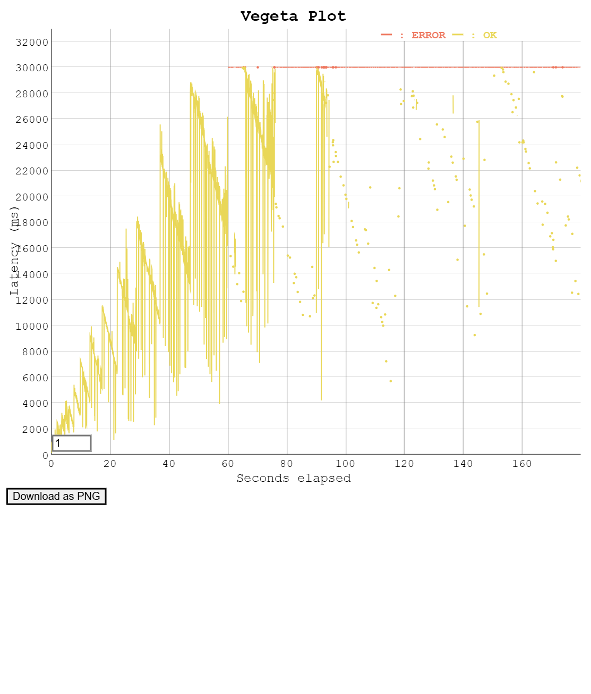

# AWS Infrastructure PoC with Terraform & CI/CD

[](https://www.terraform.io/)
[](https://golang.org/)
[](https://github.com/features/actions)

本プロジェクトは、トラフィック急増に耐えうるクラウドインフラの構築、およびそのパフォーマンス限界を実践的に検証したPoC（概念実証）です。Infrastructure as Code (IaC) による環境構築、CI/CDパイプラインによる自動デプロイ、および専用ツールを用いた負荷テストを実施し、高負荷時のボトルネック特定とキャッシュ技術の有効性を証明しました。

---

## システムアーキテクチャ


*図1: 本プロジェクトのシステムアーキテクチャ*

### AWSリソース構成
| レイヤー | サービス | 役割・設定 |
| :--- | :--- | :--- |
| **エッジ層** | Amazon CloudFront | 静的レスポンスのキャッシュ配信（レイテンシ短縮・オリジン負荷削減） |
| **ルーティング層** | Application Load Balancer (ALB) | トラフィックの受け口およびEC2群への負荷分散 |
| **コンピューティング層** | Amazon EC2 (t4g.micro) | Goアプリケーションの実行環境（ARM64 / Graviton2 プロセッサ） |
| **スケーリング制御** | EC2 Auto Scaling | CPU使用率等のメトリクスに基づくインスタンスの自律的な増減 |
| **ストレージ・状態管理** | Amazon S3 / DynamoDB | アプリバイナリの保存、およびTerraformのState/Lock管理 |

---

## 負荷テストによる仮説検証とその結果

意図的に処理の重いエンドポイント（`/api/heavy`）と軽いエンドポイント（`/api/info`）を用意し、各180秒間のテストを実施しました。

### /api/heavyと/api/infoついて

1. /api/info（I/Oバウンド型）

メモリ上の静的な値を返す、あるいはごく短い文字列を生成するだけの処理

CPUはほとんど使わず、Webサーバーの最大同時接続数やネットワーク帯域の限界をテストする。

2. /api/heavy（CPUバウンド型）

複雑な計算（素数計算、暗号化ハッシュの生成、巨大なJSONのパースなど）をループで回す処理

アプリケーションコードの計算効率や、サーバーマシンのコア数・スレッド数の限界をテストする


### テスト1: 基準値の測定
* **条件:** ALB経由 (`/api/heavy`) / 5rps
* **結果・考察:** 単一インスタンスの平常時の処理能力を定義。5rps下でレイテンシ約100msで安定稼働することを確認しました。


### テスト2: キャパシティ限界とASG挙動
* **条件:** ALB経由 (`/api/heavy`) / 30rps
* **結果・考察:** 30rps下ではキューの滞留によりレイテンシが指数関数的に増大し、タイムアウト（30秒）が発生していた。「リアクティブなAuto Scalingだけでは突発的なスパイクに間に合わない」という分散システムの現実的な課題を可視化した。


### テスト3: 
* **条件:** ALB経由 (`/api/info`) / 5rps
* **結果・考察:** /api/heavy（テスト1）と/api/infoの違いから、差分88msの遅延は計算コストとDynamoDBのR/Wの処理コストによると言える。


### テスト4: 
* **条件:** CloudFront経由(`/api/info`) / 5rps
* **結果・考察:** テスト3と比較し、キャッシュを有効化したCloudFrontを経由させることで既に処理経験のあるデータに対するインスタンスへの通信到達を防ぎ、平均レイテンシをより低く安定させることに成功した。また、エッジキャッシュから返答されるためネットワーク経路が短く一定となり、p99が24ms→19msとなり、ジッタが改善されている。


### テスト5: 
* **条件:** CloudFront経由(`/api/heavy`) / 30rps
* **結果・考察:** 動的な処理のAPIについてもキャッシュが有効であるかをテスト2と比較して検証した。1回のテストでは精度は大きく低下したが、キャッシュの効果を発揮しテストを繰り返すたびに精度が上昇し、最終的には100％にもなった。具体的には、9.68% -> 15.38% -> 27.56% -> 39.87% -> 83.69% -> 100%となった。しかし、100％に到達後も40％ほどまで低下するなど、精度は一定以上の範囲でむらが見られた。キャッシュに残存しているデータが来れば耐久出来るが、そうでないと対処できない（あるいはテスト2より状況を悪化させる）と言える



### テスト6: 
* **条件:** テスト5 + SQSによる非同期化 / 30rps
* **結果・考察:** /api/heavyに耐えられるか（その他の手法：DBチューニング、そもそも論的なスケーリングアップ、スケールアウト）


---


## 技術的工夫点

単なるリソースの作成に留まらず、以下のモダンなプラクティスを導入しました。

### 1. GitHub ActionsによるCI/CDパイプラインの構築
バックエンド（Go）のコード更新をトリガーに、ARM64アーキテクチャ向けのビルドとS3へのデプロイを完全自動化しました。これにより、開発者のローカル環境に依存しない再現性の高いデプロイフローを確立し、ヒューマンエラーを排除しました。また、インフラ（EC2のUserDataによるPull）とアプリのライフサイクルを分離した疎結合なアーキテクチャを実現しています。

### 2. TerraformにおけるState Lock（排他制御）の導入
S3バックエンドでのState管理に加え、DynamoDBを用いたState Lockを導入しました。複数人での同時 `terraform apply` による状態ファイルの競合・破壊を防ぐ、チーム開発の必須要件を満たした構成としています。

### 3. 統一規格での自動負荷テストと視覚的エビデンスの生成
テストツール（Vegeta）の実行からHTMLグラフの生成までをシェルスクリプトで完全自動化しました。テスト時間（180秒）やリクエストレートを固定することで人間による「実行ブレ」を排除し、限界点やキャッシュ効果を視覚的なグラフとして客観的に証明する仕組みを構築しました。

---


## 再現手法（Usage）

本環境は完全にIaC化されており、以下のサイクルで実装と削除が短時間で実行可能です。

```bash
# 0.下準備
ACCOUNT_ID=$(aws sts get-caller-identity --query Account --output text)
echo "Account ID: ${ACCOUNT_ID}"

# tfstate用S3バケット
aws s3api create-bucket \
  --bucket "tfstate-my-infra-poc-${ACCOUNT_ID}" \
  --region ap-northeast-1 \
  --create-bucket-configuration LocationConstraint=ap-northeast-1

aws s3api put-bucket-versioning \
  --bucket "tfstate-my-infra-poc-${ACCOUNT_ID}" \
  --versioning-configuration Status=Enabled

# State Lock用DynamoDB
aws dynamodb create-table \
  --table-name terraform-state-lock \
  --attribute-definitions AttributeName=LockID,AttributeType=S \
  --key-schema AttributeName=LockID,KeyType=HASH \
  --billing-mode PAY_PER_REQUEST \
  --region ap-northeast-1

# バイナリ用S3バケット
aws s3api create-bucket \
  --bucket "app-binaries-my-infra-poc-${ACCOUNT_ID}" \
  --region ap-northeast-1 \
  --create-bucket-configuration LocationConstraint=ap-northeast-1

# 1. バイナリをS3に再配置
cd ~/aws-infra-poc/app
ACCOUNT_ID=$(aws sts get-caller-identity --query Account --output text)
GOOS=linux GOARCH=arm64 CGO_ENABLED=0 go build -o ../dist/api-server .

aws s3 cp ../dist/api-server \
  "s3://app-binaries-my-infra-poc-${ACCOUNT_ID}/api-server" \
  --region ap-northeast-1

# 2. バックエンド基盤の作成
./init.sh

# 3. インフラ構築
terraform plan
terraform apply

# 4. アプリの配置 (GitHub Actionsを利用)

# 5. 負荷テストの実行
testコード(テスト1~4の分)
cd ~/aws-infra-poc/terraform

# --- 設定エリア ---
DURATION="180s"
RATE_NORMAL=5
RATE_HIGH=30

RESULTS_DIR=~/aws-infra-poc/load-test-results
rm -rf "${RESULTS_DIR}" && mkdir -p "${RESULTS_DIR}"

ALB_HEAVY_URL="http://$(terraform output -raw alb_dns_name)/api/heavy"
ALB_INFO_URL="http://$(terraform output -raw alb_dns_name)/api/info"
CF_INFO_URL="https://$(terraform output -raw cloudfront_domain_name)/api/info"

echo "ALB(heavy): ${ALB_HEAVY_URL}"
echo "ALB(info) : ${ALB_INFO_URL}"
echo "CF(info)  : ${CF_INFO_URL}"
echo ""

# テスト実行関数
run_test() {
  local name="$1"
  local url="$2"
  local rate="$3"

  echo "▶ [${name}] 開始 (${rate} req/s × ${DURATION})"

  # ① 負荷をかけてバイナリ保存
  echo "GET ${url}" | \
    vegeta attack -rate="${rate}" -duration="${DURATION}" \
    > "${RESULTS_DIR}/${name}.bin"

  # ② テキストレポート生成（ファイル保存+画面出力）
  vegeta report "${RESULTS_DIR}/${name}.bin" \
    | tee "${RESULTS_DIR}/${name}_report.txt"

  # ③ 個別HTMLグラフ生成
  vegeta plot "${RESULTS_DIR}/${name}.bin" \
    > "${RESULTS_DIR}/${name}_graph.html"

  echo " [${name}] 完了"
  echo "   bin   : ${RESULTS_DIR}/${name}.bin"
  echo "   report: ${RESULTS_DIR}/${name}_report.txt"
  echo "   graph : ${RESULTS_DIR}/${name}_graph.html"
  echo ""

  echo "15秒インターバル"
  sleep 15
}

# 4つのテスト実行
run_test "01_ALB_heavy_normal" "${ALB_HEAVY_URL}" "${RATE_NORMAL}"
run_test "02_ALB_heavy_high"   "${ALB_HEAVY_URL}" "${RATE_HIGH}"
run_test "03_ALB_info_direct"  "${ALB_INFO_URL}"  "${RATE_NORMAL}"
run_test "04_CF_info_cache"    "${CF_INFO_URL}"   "${RATE_NORMAL}"

#　4つのグラフ作成
vegeta plot \
  "${RESULTS_DIR}/01_ALB_heavy_normal.bin" \
  "${RESULTS_DIR}/02_ALB_heavy_high.bin" \
  "${RESULTS_DIR}/03_ALB_info_direct.bin" \
  "${RESULTS_DIR}/04_CF_info_cache.bin" \

echo "全テスト完、生成されたファイル一覧:"
ls -lh "${RESULTS_DIR}/"
explorer.exe "$(wslpath -w ${RESULTS_DIR}/)"


# test5用
echo "GET ${CF_HEAVY_URL}" | \
  vegeta attack -rate=30 -duration=180s \
  > "${RESULTS_DIR}/05_CF_heavy_cached.bin"

vegeta report "${RESULTS_DIR}/05_CF_heavy_cached.bin" \
  | tee "${RESULTS_DIR}/05_CF_heavy_cached_report.txt"

vegeta plot "${RESULTS_DIR}/05_CF_heavy_cached.bin" \
  > "${RESULTS_DIR}/05_CF_heavy_cached_graph.html"

echo "finish"


# 6. リソースの撤収
terraform destroy
AWSコンソール上で初めに作ったS3やDynamoDBのデータも削除

```


---
## 今後の展望

今回は実験の規模を踏まえ扱いませんでしたが、以下の技術導入が今後の発展に当たると考えています。

Terraformのディレクトリ分割・モジュール化: ネットワーク層、コンピューティング層、データベース層などをModuleとして分割し、ディレクトリ方式の採用し影響範囲の限定とコードの再利用性を向上させる

静的コード解析のCI組み込み: tflintやtfsecをGitHub Actionsに組み込み、構文エラーやクラウドのベストプラクティス違反、セキュリティ上の脆弱性をapply前に自動検知する仕組みを構築する
